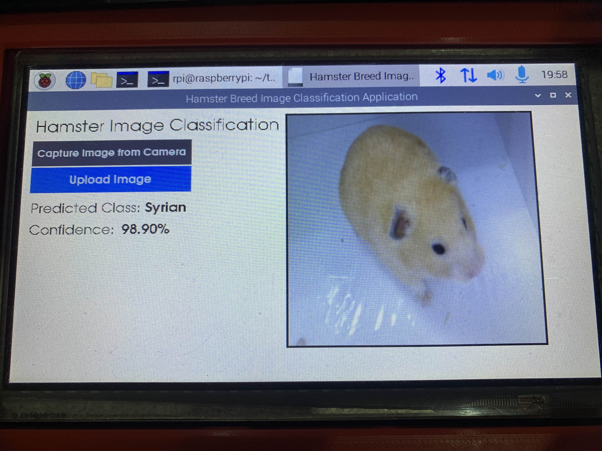

# 🐹 Image Recognition of Different Hamster Breeds Using Convolutional Neural Networks 📷 

    
    
    
    
    

## ✨ Features
- 🤖 Tailor-made CNN model for hamster breed identification based on VGG16 architecture
- 📷 Captures images using webcam (we used Logitech C270 as our main camera)
- 📁 File dialog for image uploads

## 🛠️ Built With
- **Raspberry Pi 4B** with 4GB RAM as its main hardware
- **Python** — core programming language (both training and application development)
- **TensorFlow** — deep learning framework used for model training and deployment
- **Keras** — high-level API for building and customizing the VGG16-based CNN model
- **tkinter** — standard GUI library
- **customtkinter** — modern UI look

## ⚠️ Disclaimer
This repo only includes the code for the application software specifically made for Raspberry Pi 4B, and the confusion matrix of the custom-made CNN model for hamster detection. Cloning or attempting to run the project as-is will likely be unsuccessful, as it relies on external assets and resources that are not included in this repository. The code is intended to demonstrate structure and functionality, but it is not a complete, standalone application.

## 📖 IEEE Article
If you'd like to learn more about this project, please refer to the link below to read our official thesis paper

[Link to IEEE Article](https://ieeexplore.ieee.org/document/10730364)
